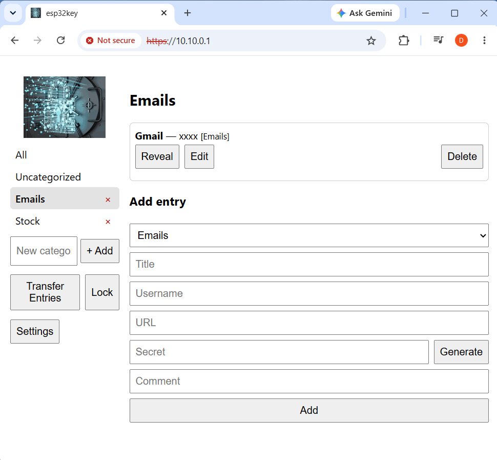

# esp32keyManagement

A personal encrypted credential vault that runs on a bare ESP32-S3 dev board.
You reach it from a browser over HTTPS — on the device's own WiFi hotspot or
over the USB cable — unlock it with a master password, and manage your
credentials. A second "transfer password" gates a plaintext export you can use
to migrate your credentials to another ESP32-S3 or to another password manager.

Built with ESP-IDF v6.0.1.



*The browser-based vault, unlocked. See the [User Guide](docs/USAGE.md) for a full walkthrough with screenshots.*

## Features

- Encrypted credential vault: stored secrets are useless without the master
  password (app-level AES-256-GCM, key derived with PBKDF2).
- Browser-based web UI served over HTTPS, available on two interfaces at once:
  - WiFi softAP — `https://192.168.4.1`
  - USB network gadget (NCM) — `https://10.10.0.1` (use the vault while your
    PC's WiFi stays on the internet)
- Add / edit / delete credentials; secrets revealed per-entry on demand.
- Change the master password without re-encrypting every entry.
- Plaintext JSON export/import for migrating to another device or password
  manager; export is gated by a separate transfer password.
- Session hardening: HttpOnly + Secure + SameSite cookie, 3-minute idle
  auto-lock (actively enforced), and login rate-limiting / lockout.
- Onboard RGB status LED indicating vault state, with a green fade counting
  down to idle auto-lock (see [Status LED](#status-led)).

## Security model

Two passwords are set during first-run setup:

- **Master password** — everyday unlock. PBKDF2-HMAC-SHA256 derives a
  Key-Encrypting-Key (KEK); a random 256-bit Data-Encryption-Key (DEK) is
  wrapped under the KEK and stored. Each credential is encrypted with the DEK
  (AES-256-GCM, unique nonce per entry). The DEK lives in RAM only while
  unlocked and is wiped on logout, idle timeout, or reboot. Neither password is
  ever stored in plaintext.
- **Transfer password** — a confirmation gate for export. Export requires it,
  but the resulting file is **plaintext JSON, not encrypted** — every secret is
  readable, by design, so the export can be imported into other password
  managers. Treat the file as sensitive: store it safely and delete it when
  done. Import does not require the transfer password (the file is already
  plaintext and the session cookie already grants full write access).

Cryptography uses the PSA Crypto API (the classic mbedTLS primitives are private
in ESP-IDF v6). The TLS server uses a self-signed EC P-256 certificate generated
on first boot and stored on the device — your browser will show a one-time
"not secure" warning that you can accept (or trust the cert to silence it).

## Hardware-backed security (roadmap)

The ESP32-S3 crypto accelerator is already used for the heavy lifting: PBKDF2
runs on the hardware SHA engine, AES-256-GCM block operations run on the hardware
AES engine, and all keys/nonces come from the hardware TRNG. (The S3 has no
hardware GHASH block, so the GCM authentication tag is finished in software —
that is the chip's ceiling, not a configuration gap.)

What the accelerator does **not** yet do is protect keys *at rest*. Today the
wrapped DEK and all entry ciphertext sit in plaintext flash/NVS, so an attacker
who dumps the flash can brute-force the master password offline. The S3's
hardware security peripherals can close that gap — planned hardening steps:

- **Flash encryption** — burn an AES key into eFuse so the whole flash (firmware
  *and* NVS, including the wrapped DEK and entry ciphertext) is transparently
  encrypted at rest; a chip-off / flash dump then yields only ciphertext.
  Enabling it burns eFuses and is irreversible on a given board — develop in
  "Development" mode first.
- **eFuse-bound key via the Digital Signature (DS) / HMAC peripheral** — wrap or
  derive the KEK with a key held in eFuse that software cannot read, binding the
  vault to the physical chip. It then can't be unlocked or brute-forced from a
  flash image alone, or moved to another board.
- **Secure Boot v2** — require signed firmware, so a stolen device can't be
  reflashed with an image that exfiltrates secrets.

These layer on top of the existing app-level AES-256-GCM without changing the
on-disk vault format. None are enabled in this build.

## Hardware

- An ESP32-S3 dev board with PSRAM and at least 4 MB flash.
- A USB cable (also used for the USB network interface).
- Optional: an onboard WS2812 ("NeoPixel") RGB LED for the status indicator —
  GPIO48 on the ESP32-S3-DevKitC-1 (some boards use GPIO38). The vault runs fine
  without one.

PSRAM defaults to Octal mode (`CONFIG_SPIRAM_MODE_OCT`). If your module uses
Quad PSRAM, change that in `sdkconfig.defaults` and delete `sdkconfig` to
regenerate.

## Build and flash

ESP-IDF v6.0.1 must be installed. Activate the environment, set the target, and
build:

```sh
. $IDF_PATH/export.sh          # Linux/macOS
idf.py set-target esp32s3
idf.py -p <PORT> flash monitor
```

On Windows, `idf.py` can exit silently from PowerShell if `MSYSTEM` is set (e.g.
in a Git Bash environment). Use cmd with the batch export script:

```bat
set "MSYSTEM=" && call C:\esp\v6.0.1\esp-idf\export.bat && idf.py -p <PORT> flash monitor
```

The first build compiles all of ESP-IDF and can take 10-20 minutes.

## Usage

For a full walkthrough with screenshots — connecting, first-run setup, unlocking,
managing credentials, transfer, and settings — see the **[User Guide](docs/USAGE.md)**.

Quick start:

1. Power on the board. Join the WiFi network `esp32key` (default password
   `1234567890`), or plug in USB.
2. Browse to `https://192.168.4.1` (WiFi) or `https://10.10.0.1` (USB) and
   accept the certificate warning.
3. First run: the Setup screen asks for a master password and a transfer
   password. Create both.
4. Unlock with the master password to view, add, edit, delete, and reveal
   credentials.
5. Transfer screen: enter the transfer password to download a **plaintext** JSON
   export (`esp32key-export.json` — keep it safe), or import a JSON file from
   another device or password manager.

## Status LED

If the board has an onboard WS2812 RGB LED (GPIO48), it shows the vault's
security state at a glance, at low brightness:

| LED               | Meaning                                                        |
| ----------------- | -------------------------------------------------------------- |
| **Blue**          | No vault yet — run first-time setup                            |
| **Red**           | Locked                                                         |
| **Blinking red**  | Unlocking — the PBKDF2 key derivation takes ~1 s               |
| **Green**         | Unlocked                                                       |

While unlocked, the green **fades from bright to dark over the 3-minute idle
window** as auto-lock approaches; any web-UI activity resets it to full
brightness. When the idle timer expires the vault auto-locks (the DEK is wiped
from RAM) and the LED returns to **red**.

The indicator is driven by the `status_led` component, which mirrors live vault
state on a timer — no per-request hooks. The pin is `LED_GPIO` in
`components/status_led/status_led.c`; change it to `38` for boards that wire the
LED there. If LED init fails the vault still runs normally, just without the
indicator.

## Project layout

```
components/
  vault_crypto/   PBKDF2, AES-256-GCM, DEK wrap/unwrap, portable bundle (PSA)
  vault_store/    NVS persistence
  vault/          credential model: setup/unlock/lock/CRUD, change-pw, export/import
  vault_session/  session tokens, idle timeout, login lockout
  status_led/     onboard WS2812 status indicator (vault state + idle countdown)
  vault_cert/     self-signed TLS cert generation + persistence
  net_wifi_ap/    WiFi softAP bring-up
  net_usb/        TinyUSB NCM network interface + DHCP server
  vault_api/      HTTPS server, REST API, embedded web UI
main/             app_main wiring
test_app/         on-target Unity test runner
docs/superpowers/ design spec and implementation plan
```

## Testing

Unit tests run on the board via a dedicated test runner:

```sh
cd test_app
idf.py -p <PORT> flash monitor
```

At the Unity menu, run each suite: `[vault_crypto]`, `[vault_store]`,
`[vault]`, `[vault_session]`.

## Known limitations

- App-level encryption only; the ESP32-S3 hardware security peripherals (flash
  encryption, eFuse-bound key, Secure Boot) are not enabled — see
  [Hardware-backed security](#hardware-backed-security-roadmap) for the roadmap.
- Decrypted secrets may linger in scratch RAM after lock until overwritten.
- Export files are plaintext (for portability) — anyone with the file can read
  every secret. Handle and delete them accordingly.

## License

Released under the [MIT License](LICENSE.txt). Copyright (c) 2026 Daniel Zeng.
