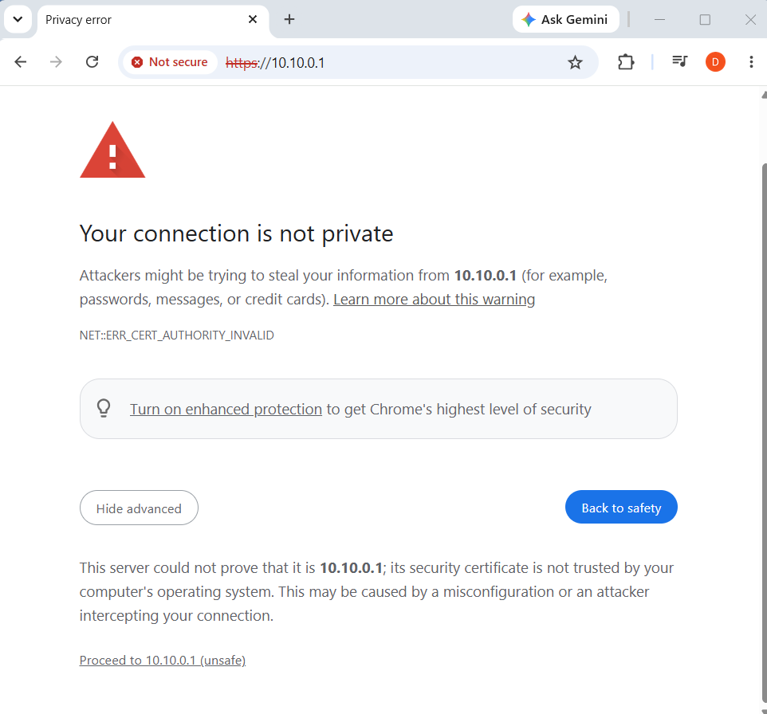
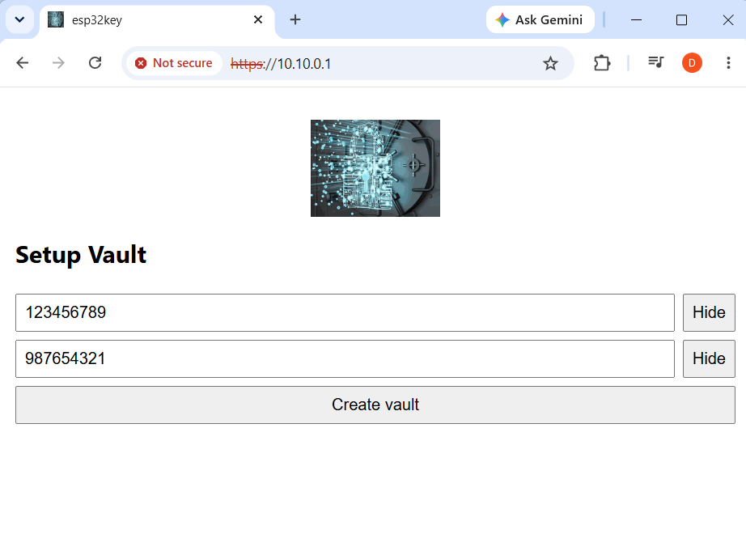
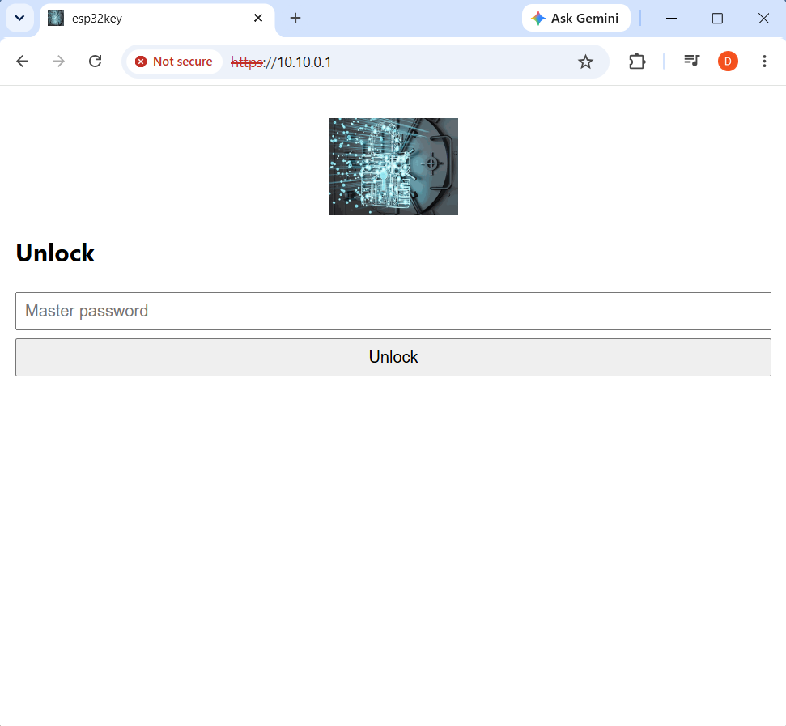

# esp32key — User Guide

esp32key is a personal encrypted credential vault that runs on an ESP32-S3 board.
You reach it from any browser over HTTPS — either on the device's own WiFi
hotspot or over the USB cable — unlock it with a master password, and manage your
credentials from a small web app.

This guide walks through everyday use, from connecting to the device to adding,
revealing, and transferring credentials. For build/flash instructions and the
security model, see the [README](../README.md).

---

## 1. Connect to the device

The vault serves the same web UI on two interfaces at once — use whichever is
convenient:

| Interface | How to connect | Address |
| --------- | -------------- | ------- |
| **WiFi hotspot** | Join the WiFi network `esp32key` (default password `1234567890`). | `https://192.168.4.1` |
| **USB cable** | Plug the board into your PC; it appears as a USB network adapter. Your PC's own WiFi stays connected to the internet. | `https://10.10.0.1` |

> The network name and WiFi password can be changed later under **Settings →
> WiFi access point**.

### Accept the certificate warning

The device uses a **self-signed TLS certificate** generated on first boot, so
your browser shows a one-time "Your connection is not private" warning. This is
expected — the traffic is still encrypted; the browser simply can't verify the
certificate against a public authority.

Click **Advanced**, then **Proceed to … (unsafe)** to continue. (You can
optionally trust the certificate to silence the warning on future visits.)

---

## 2. First-run setup

The very first time you open the vault, it has no master password yet, so you
land on the **Setup Vault** screen. You create two passwords here:

- **Master password** — your everyday unlock password. Everything in the vault
  is encrypted with a key derived from it. **There is no recovery if you forget
  it.**
- **Transfer password** — a separate confirmation password that gates the
  plaintext export (and clearing all entries). It is not used for daily unlock.

Type each one, use the **Show** / **Hide** button to confirm you typed it
correctly, then click **Create vault**.

> Choose strong, distinct passwords. Neither is ever stored in plaintext, and
> neither can be recovered — only changed later (from **Settings**, while
> unlocked).

---

## 3. Unlock

On every later visit — and after the vault locks — you'll see the **Unlock**
screen. Enter your **master password** and click **Unlock**. Use the **Show**
button if you want to verify what you typed.

Unlocking takes about a second while the key is derived (a deliberate
brute-force slowdown); a progress bar fills while it works.

---

## 4. Managing credentials

Once unlocked you reach the main vault view. The left sidebar holds your
**categories**; the right side lists the entries in the selected category and
the **Add entry** form.

### Categories (left sidebar)

- **All** — every entry, regardless of category.
- **Uncategorized** — entries with no category assigned.
- Your own categories (e.g. *Emails*, *Stock*) appear below. Click one to filter
  the list to it.
- **New category** field + **+ Add** — create a category.
- The small **×** next to a category deletes it (its entries move to
  *Uncategorized*).

### Viewing and editing entries

Each entry shows its **title**, **username**, and **category**. The secret stays
hidden until you ask for it:

- **Reveal** — show the entry's secret on demand.
- **Edit** — change any field of the entry.
- **Delete** — permanently remove the entry.

### Adding an entry

Fill in the **Add entry** form and click **Add**:

| Field | Notes |
| ----- | ----- |
| **Category** | Pick from the dropdown (defaults to the current category). |
| **Title** | A label for the entry (e.g. *Gmail*). |
| **Username** | The account/login name. |
| **URL** | Optional site or service address. |
| **Secret** | The password/secret. Click **Generate** to create a strong random one. |
| **Comment** | Optional free-text note. |

### Locking

- **Lock** (sidebar) immediately locks the vault and returns to the Unlock
  screen. Clicking the **logo** also locks.
- The vault **auto-locks after a period of inactivity** (3 minutes by default;
  configurable in Settings). When it locks, the decryption key is wiped from
  RAM and you must unlock again.

---

## 5. Transfer: export & import

Click **Transfer Entries** in the sidebar to move credentials between devices or
password managers.

- **Export** — enter your **transfer password** and click **Download export
  file** to save a JSON file (`esp32key-export.json`).
  > ⚠️ The export is **plaintext** — every secret is readable. Store it somewhere
  > safe and delete it when you're done.
- **Import** — choose a JSON file and click **Import file**. Entries are merged:
  an imported entry replaces a local one with the same title + username; the
  rest are added. (Import does not require the transfer password.)

---

## 6. Settings

Click **Settings** in the sidebar (while unlocked) to:

- **WiFi access point** — change the hotspot name (SSID) and password. Saving
  **restarts the device**, so you'll need to reconnect to the new network and
  unlock again.
- **Auto-lock** — set the idle timeout in seconds (30–3600).
- **Maintenance**
  - **Clear Entries** — permanently delete *all* entries (categories and your
    passwords are kept). Gated by the transfer password.
  - **Reset Device** — change the **master password** and/or the **transfer
    password**.

---

## 7. Status LED (optional)

If your board has an onboard RGB LED, it reflects vault state at a glance:

| LED | Meaning |
| --- | ------- |
| **Blue** | No vault yet — run first-time setup |
| **Red** | Locked |
| **Blinking red** | Unlocking (key derivation in progress) |
| **Green** | Unlocked — fades toward dark as auto-lock approaches |

Any activity in the web UI resets the fade to full brightness. When the idle
timer expires the vault auto-locks and the LED returns to red.

---

## Tips & safety

- **Don't lose the master password** — there is no recovery; the data is
  unrecoverable without it.
- **Treat export files as sensitive** — they're plaintext. Delete them after
  use.
- **Change the default WiFi password** in Settings before relying on the
  hotspot.
- The "not secure" certificate warning is expected for a self-signed
  certificate; the connection is still encrypted.
